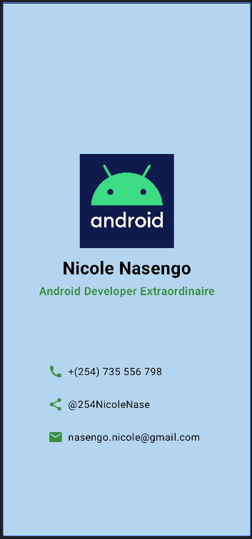

# Business Card App

This is a simple Business Card App built using Android Studio and Kotlin. The app displays a personal business card with contact information and a profile image.

## Features

- Displays a profile image
- Shows name and description
- Provides contact information including phone number, social media handle, and email address

## App Preview



## Getting Started

### Prerequisites

- Android Studio
- Kotlin

### Installation

1. Clone the repository:
    ```bash
    git clone https://github.com/yourusername/businesscardapp.git
    ```
2. Open the project in Android Studio.
3. Build and run the app on an emulator or physical device.